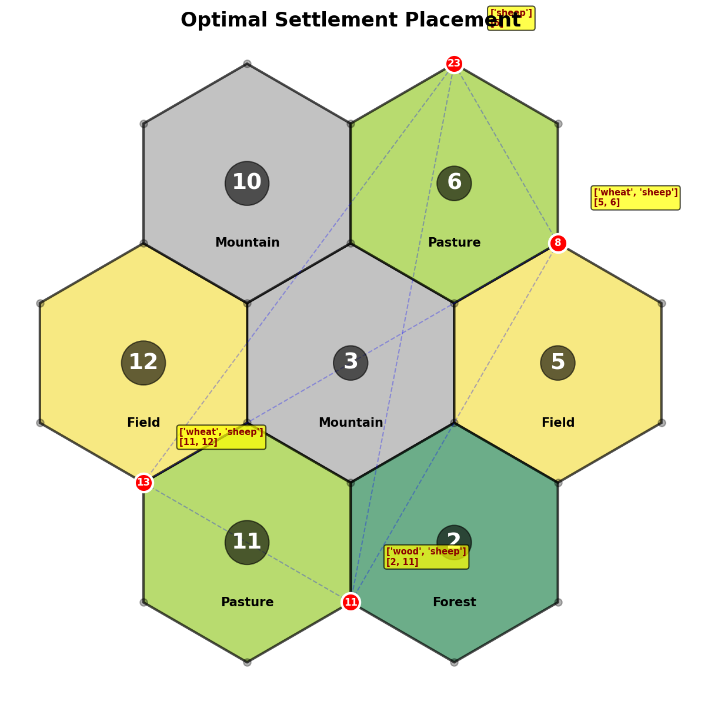
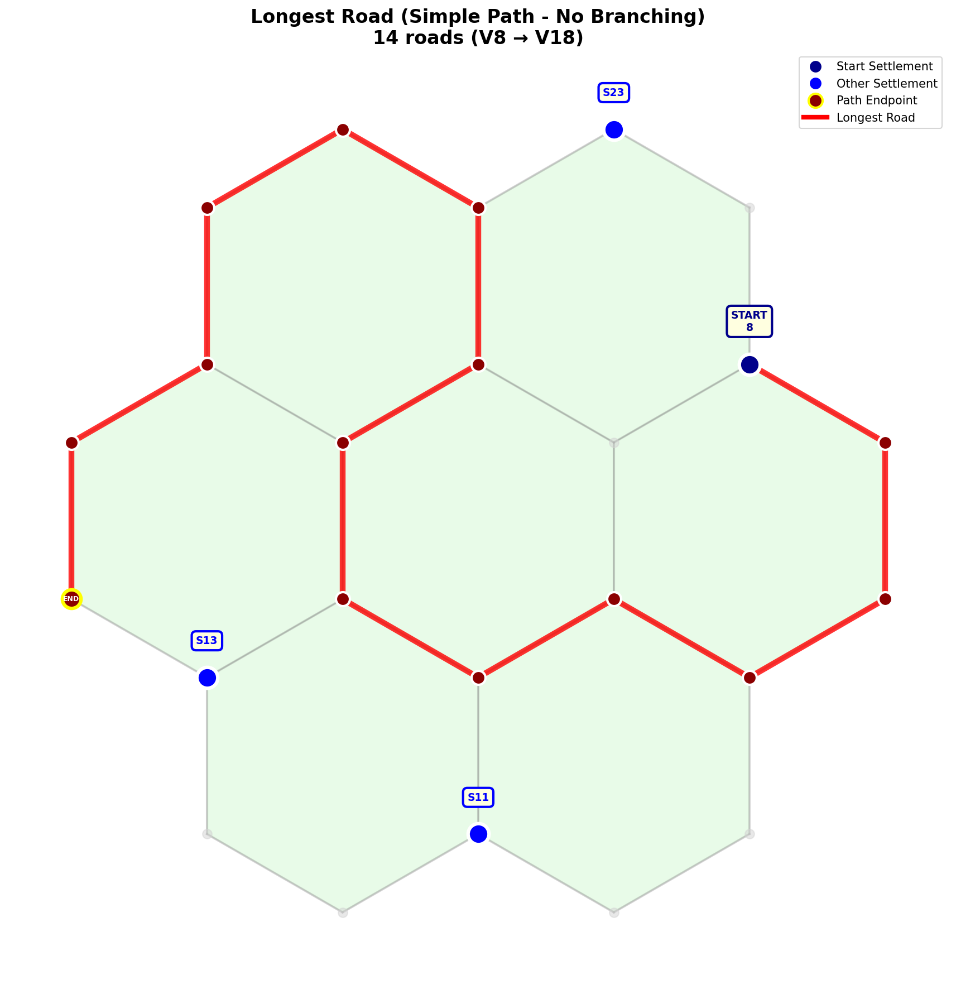

# 🎲 Quantum Catan Optimizer

This project was developed during the **Qiskit Fall Fest 2025**, organized by **Freeyamind** in partnership with **IBM**, where it won an award during the hackathon.

The project explores the application of quantum computing and hybrid (quantum-classical) algorithms to solve complex optimization problems in the game of Catan. It utilizes the **Qiskit** framework to simulate quantum circuits that optimize settlement placement, road construction, and resource management.

## 🏆 Project Context
In the game of Catan, making optimal decisions requires evaluating a massive number of variables: dice roll probabilities, resource diversity, distance rules, and construction costs. This project demonstrates how quantum computing can tackle these combinatorial optimization problems more efficiently than classical "brute-force" methods.

## 🚀 Features and Algorithms

### 1. Settlement Placement Optimization (QAOA)
Optimizes the initial placement of settlements by balancing resource diversity and production probability while strictly adhering to game constraints.

### 2. Longest Road (Quantum Walk Inspired)
Calculates the longest simple path (no branching) starting from the user's settlements to maximize the "Longest Road" victory points.

### 3. Resource Trading and Allocation (Grover's Algorithm)
Determines the optimal sequence of actions (building vs. buying cards) to maximize Victory Points based on current resource availability.

---

## 🧠 Algorithm Deep Dive

### 1. Settlement Optimization (QAOA)
To find the best starting positions, we mapped the board to a **Quadratic Unconstrained Binary Optimization (QUBO)** problem.
* **The Cost Function:** Each vertex $i$ is assigned a weight based on the probability of its adjacent tiles and resource diversity. 
* **The Constraints:** We implemented a high penalty term for adjacent vertices to enforce the "Distance Rule" (no two settlements on adjacent nodes).
* **Quantum Execution:** We used a 2-layer **QAOA** circuit. A classical optimizer (**COBYLA**) iteratively tunes the quantum parameters $\beta$ and $\gamma$ to find the bitstring that minimizes the energy (maximizing the placement score).

### 2. Longest Road (Simple Path Search)
Finding the longest simple path is an NP-Hard problem. 
* **Graph Representation:** The Catan grid is converted into a graph $G(V, E)$.
* **Constraints:** The algorithm ensures the path is **simple** (no node has a degree $> 2$ within the path) and that it originates from one of the settlements chosen in the first phase.
* **Validation:** The system validates connectivity and connectivity to the base settlement at every step.

### 3. Resource Management (Grover's Search)
We applied the principles of **Grover's Algorithm** to search for the optimal "shopping list" of items.
* **The Oracle:** The quantum oracle marks states (combinations of actions) that are affordable given the player's resource pool.
* **Amplitude Amplification:** We amplify the probability of measuring the state that yields the maximum points (e.g., prioritizing a City over a Road when resources allow).

---

## 🛠️ Visualization and Outputs
The script generates visual representations of the decisions:
* `settlement_placement.png`: Map showing the optimized settlement locations with resource data.
* `longest_road_optimized.png`: Map showing the longest valid road path without branching.

## 💻 How to Run the Project

### Prerequisites
Make sure you have Python installed (Python 3.8+ recommended).

### Installing Dependencies
You will need the following Python packages:

```bash
pip install numpy matplotlib networkx scipy qiskit qiskit-aer
```

## 📊 Example Run & Visual Results

To demonstrate the capabilities of the quantum-classical optimizer, here is an example of a program execution. 

**Terminal Input:**
* Desired number of settlements: `4`
* Maximum number of roads: `14`

### 1. Optimal Settlement Placement (QAOA Output)
The QAOA algorithm successfully identified the 4 best starting positions (Nodes 8, 11, 13, and 23) by balancing resource diversity (wheat, sheep, wood) and prioritizing high-probability dice rolls.



### 2. Longest Road (Quantum Walk Output)
Starting from the optimized settlements, the algorithm calculated the longest simple path. As seen below, it successfully generated a 14-edge continuous road from Node 8 to Node 18 without any branching, perfectly respecting the game's constraints.



### Execution
Run the main file directly from your terminal:

```bash
python main.py
```

The program will prompt you in the terminal to enter the desired number of settlements and the maximum number of roads. After the quantum-classical hybrid optimization, it will display a summary and save the images.

## ⚙️ Tech Stack
* **Language**: Python
* **Quantum Computing**: Qiskit, Qiskit AerSimulator
* **Classical Optimization**: SciPy (COBYLA)
* **Graph Theory**: NetworkX
* **Visual Rendering**: Matplotlib

---
*Project created for the Qiskit Fall Fest 2025 Hackathon.*
